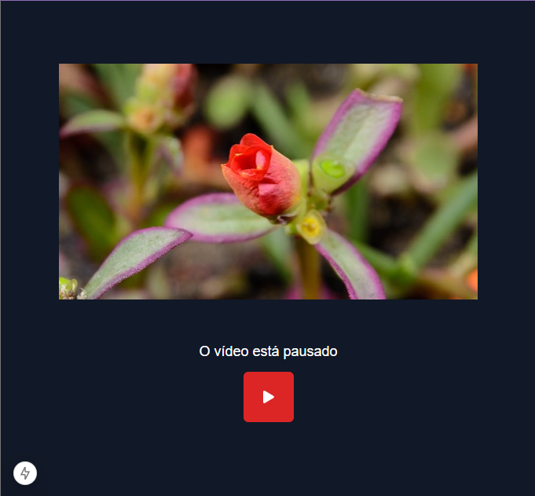

# Play-Pause Video Player

  

Este é um projeto simples de **player de vídeo** com funcionalidade de **Play/Pause**, construído com **React**, **TypeScript**, **TailwindCSS** e **React Icons**.

## 💻 Sobre o Projeto

O **Play-Pause Video Player** é uma aplicação simples que permite reproduzir e pausar vídeos, utilizando o estado do React para controlar a reprodução e a exibição de ícones dinâmicos de Play/Pause. O vídeo é gerido por um componente `VideoPlayer`, que recebe como props o link do vídeo e o estado de reprodução.

## 🚀 Tecnologias

- **React**: Biblioteca para a construção da interface de usuário.
- **TypeScript**: Superset de JavaScript que oferece tipagem estática.
- **TailwindCSS**: Framework de CSS utilitário para estilização rápida.
- **React Icons**: Biblioteca de ícones para React.

## 📺 Funcionalidades

- Play/Pause de vídeo com controle dinâmico.
- Ícones de Play e Pause exibidos de forma interativa.
- Estilização utilizando TailwindCSS.
- Reutilização de componentes com o `VideoPlayer`.

## 📝 Como Funciona

### Componente `VideoPlayer`

O componente `VideoPlayer` é responsável pela exibição do vídeo. Ele utiliza uma referência (`useRef`) para controlar o elemento `<video>` diretamente e gerenciar a reprodução com base no estado `isPlaying`. Quando o estado `isPlaying` é `true`, o vídeo é reproduzido, caso contrário, ele é pausado.

### Componente `Page`

O componente `Page` controla a interação com o vídeo, oferecendo os ícones de Play/Pause e exibindo uma mensagem sobre o status do vídeo. Ele utiliza o hook `useState` para alterar o estado do vídeo entre reproduzindo e pausado.

## 📦 Como Rodar o Projeto Localmente

1. Clone o Repositório

bash
git clone <URL_DO_REPOSITORIO>

2. Instale as Dependências
Dentro do diretório do projeto, execute o comando:

npm install

3. Rode o Projeto
Para rodar o projeto localmente, use:

npm run dev

📬 Contato
Em caso de dúvidas ou sugestões, entre em contato:

Email: devgabrielsilveira@gmail.com  
LinkedIn: Gabriel Silveira  
<b> Desenvolvido por Gabriel Silveira </b> 🚀
